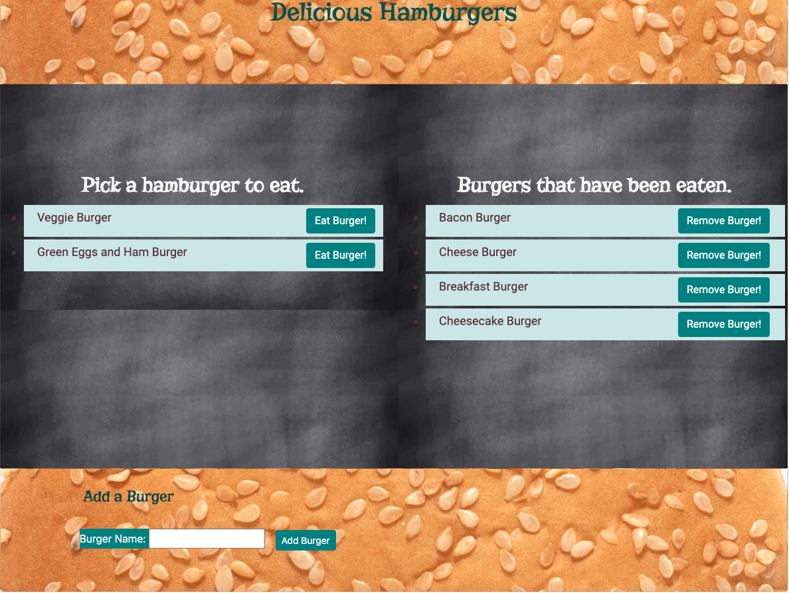

# Burger Application

## Description

This application uses a full CRUD environment using a mySQL database to store data.  The application loads with burger options alreadly inputed with two separate lists. One list allows you to click a button to eat the burger and it will move to the second list as devoured and you can remove the burger from the database by clicking the remove button. If you want to add new burgers to be devoured you can use the add a burger form at the bottom of the application. This application uses mysql, express, and express-handlebars.  
 

## Installation and Instructions

        1. Load Packages:

            npm init

        2. Run Application:

            node server.js
 

## Requirements

        1. Install Dependencies:

            npm install mysql
            npm install express
            npm install express-handlebars

        2. Database:

            Install latest version of MySql and MySql Workbench.

 

## Screenshots of Application:

 

 

 

## Link to application:

https://delicious-burgers.herokuapp.com/

 

## Link to repository:

https://github.com/rwanke14/burgerlogger

 

## Additional sources:

Also worked with my study group to better understand how to apply what we learned in class to this readme. Note: Some code may look similar since we generally come out these thinking in the same ways. 

Feedback, brainstorming, and general support to study group:

        1. Young Ji Kim - https://github.com/youjmi
        2. Amir Ashtiany - https://github.com/Alexfit4
        3. Johnnie Simpson - https://github.com/balokdecoy
        5. Frankie Rosado - https://github.com/Franciscorosado09
